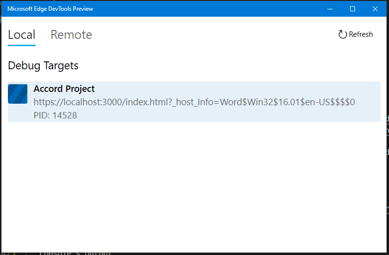

# Cicero Word Add-in

Microsoft Word Add-in for editing texts of Smart Legal Contracts.

## For Developers

The following instructions will help you set up the project on your development
environment.

#### Prerequisites

1. Operating System: Windows or MacOSX
2. MS Word (preferably desktop version)
3. Node JS (preferably v12 as it is the latest LTS)

#### Setup Instructions

1. Clone the project using HTTPS or SSH.
    ```bash
    $ git clone https://github.com/accordproject/cicero-word-add-in.git
    ```

2. Install dependencies of the project.
    ```bash
    npm i
    ```

3. Firing up the server diverge a little depending upon the OS you're using.
    1. **On Windows:** Run `npm start` and it will start the server and
       automatically sideload the the add-in on the desktop version of MS Word.
    2. **On MacOSX:** Run `npm run dev-server` for starting the server and run
     `npm start` to sideload the add-in.

4. To test your add-in on the web, run `npm run start:web` and this will start
   the server. You can then sideload the add-in on the web version of MS Word
   by following the steps given [here](https://docs.microsoft.com/en-us/office/dev/add-ins/testing/sideload-office-add-ins-for-testing#sideload-an-office-add-in-in-office-on-the-web).

5. Once the add-in is successfully loaded, the icon for add-in will be displayed
   on the **Home** tab. Go there and click the button with name
   "Cicero Word Add-in".

6. For more information on setting up Word add-in for development, follow this
   [documentation](https://docs.microsoft.com/en-us/office/dev/add-ins/quickstarts/word-quickstart).

#### Debugging Add-in

1. **Web version:** Open the browser's developer tools and see the console's
   output.

2. **Desktop version**
   -  **Windows:** [Download the developer tool](https://www.microsoft.com/en-us/p/microsoft-edge-devtools-preview/9mzbfrmz0mnj?activetab=pivot:overviewtab)
   separately. Once you are able to start the server and sideload the add-in,
   you will see "Accord Project" as an option in the tool.
   
   -  **Mac:**
      1. Open a terminal and run the following 4 commands (this is a one-time setup step).
      ```
      defaults write com.microsoft.Word OfficeWebAddinDeveloperExtras -bool true
      defaults write com.microsoft.Excel OfficeWebAddinDeveloperExtras -bool true
      defaults write com.microsoft.Powerpoint OfficeWebAddinDeveloperExtras -bool true
      defaults write com.microsoft.Outlook OfficeWebAddinDeveloperExtras -bool true
      ```
      2. Sideload your add-in and open it in Word for Mac.
      3. Right click inside your add-in and choose "Inspect Element".
      4. The Safari Web Inspector console will automatically open, where you can
         debug the add-in the same way you would debug a web app. (ie. use the
         `Console` tab to view printed logs and errors, the `Element` tab to
         inspect the HTML and CSS, the `Network` tab for network calls, etc).
 
## Contributing

The Accord Project technology is being developed as open source. All the
software packages are being actively maintained on GitHub and we encourage
organizations and individuals to contribute requirements, documentation,
issues, new templates, and code.

Find out what’s coming on our [blog](https://medium.com/@accordhq).

Join the Accord Project Technology Working Group [Slack channel](https://accord-project-slack-signup.herokuapp.com/) to get involved!

For code contributions, read our [contribution guidelines](https://github.com/accordproject/techdocs/blob/master/CONTRIBUTING.md).

ESLint has been integrated with this project to stay consistent with the code
practices we follow. Run `npm run lint` to check errors or `npm run lint:fix` to
fix those errors which ESLint is capable to fix.

## License

Accord Project source code files are made available under the [Apache License, Version 2.0](/LICENSE).
Accord Project documentation files are made available under the [Creative Commons Attribution 4.0 International License](http://creativecommons.org/licenses/by/4.0/) (CC-BY-4.0).

Copyright 2018-2019 Clause, Inc. All trademarks are the property of their respective owners. See [LF Projects Trademark Policy](https://lfprojects.org/policies/trademark-policy/).
